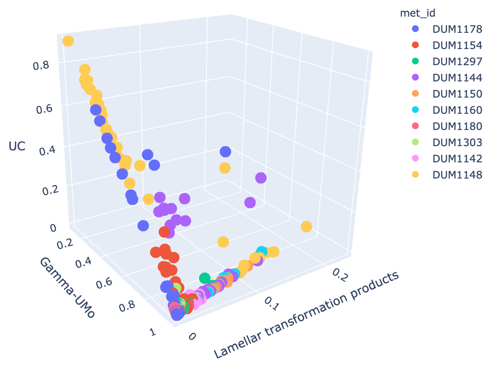
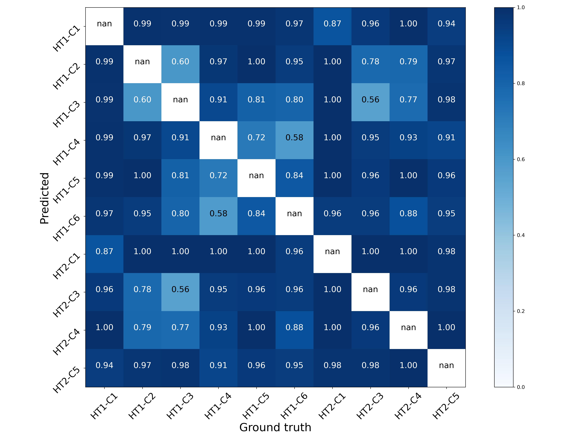

# Microstructure Characterization II

This is the repository for microstructure characterization research II since May 2019. It consists of two parts:

- **Discriminative**: Feature engineering for microstructure characterization
- **Generative**: Representation learning of microstructure with GANs

## Publication

This repo contains code for reproducing key results in [Image-driven discriminative and generative machine learning algorithms for establishing microstructure-processing relationships](#).

(Our previous work on this topic: [An image-driven machine learning approach to kinetic modeling of a discontinuous precipitation reaction](https://arxiv.org/abs/1906.05496).)

## Feature Engineering for Microstructure Characterization

### Collect features

The list of features implemented here are:
- Area features
- Spatial features
- Haralick features (from mahotas)
- LBP features (from scikit-image)

To collect features from image files, run
```python
import features
feature_names = ['area', 'spatial', 'lbp', 'haralick']
f = features.collect_features_by_filenames(filenames, features_names)
```

Default arguments of ```collect_features_by_filenames()``` include:
- ```d=15```: param for bilateral filtering used for segmentation, diameter of each pixel neighborhood
- ```sigma_color=75```: param for bilateral filtering used for segmentation, filter sigma in the color space
- ```sigma_space=75```: param for bilateral filtering used for segmentation, filter sigma in the coordinate space
- ```with_info_bar=True```: boolean, whether to remove info bar from the image using ```utils.crop_image()```
- ```distance=1```: param for haralick features, the distance to consider while computing the occurence matrix
- ```P=10```: param for LBP features, number of circularly symmetric neighbor set points (quantization of the angular space)
- ```R=5```: param for LBP features, radius of circle (spatial resolution of the operator)



### Training and evaluating a model

To reproduce the results from the experiments in Section III C, comment/uncomment necessary lines to configure the experiment:
- set of features
- output directory and prefix
- experiments to run

A log file will be saved to the ```<output_dir>```. Trained models, if any, will be saved to ```<model_dir>```. All output files will have ```<output_prefix>``` in the filename.

#### Plot the confusion matrix for binary classification



The output figure will be saved to the ```./figures``` directory.

## Representation Learning with GANs

### System requirements

## In ```utils.py```

```utils.py``` provides
