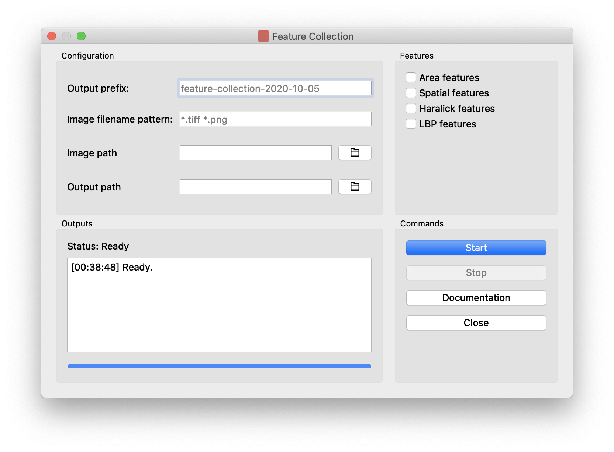
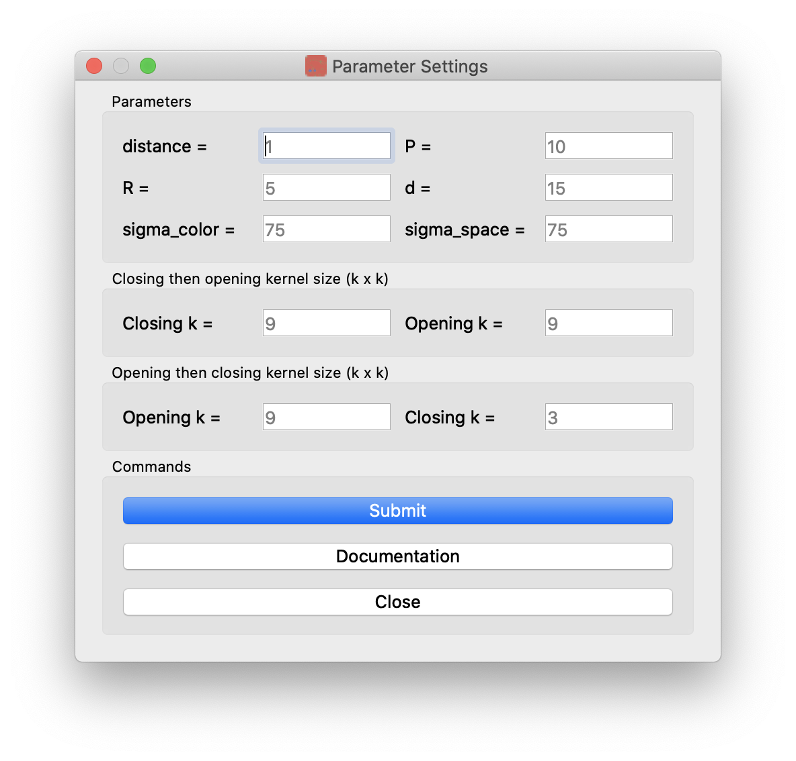
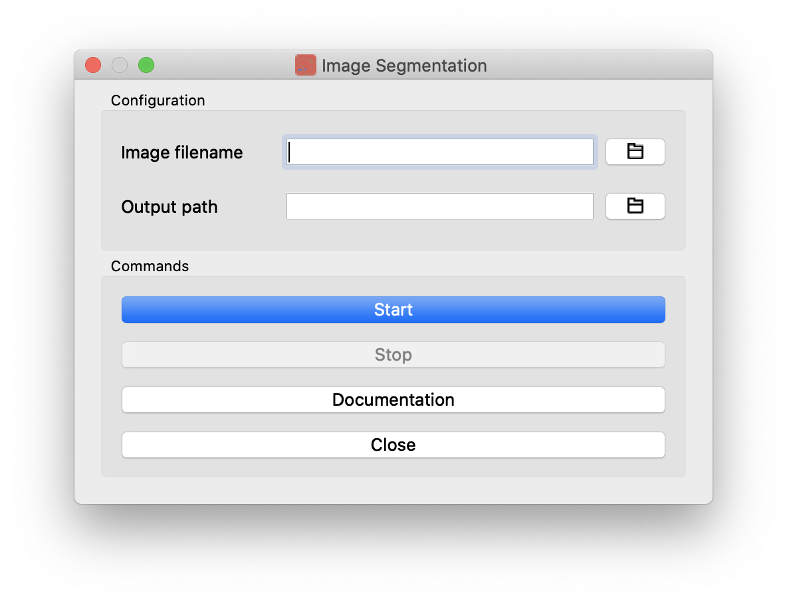

# Documentation

* Feature collection
* Parameter settings
* Image segmentation
* Troubleshooting

## Feature collection



* Configurations:
  * ```Output prefix```: prefix for output files; default: ```feature-collection-{{ date }}```.
  * ```Image filename pattern```: image filename pattern matching rules, split by space; default: ```*.tiff *.png```. See [gnu.org](https://www.gnu.org/software/bash/manual/html_node/Pattern-Matching.html).
  * ```Image path```: path to the image files
  * ```Output path```: path for output files
* Features: select the features to be collected
  * Area features
  * Spatial features
  * Haralick features
* Commands:
  * Start: start feature collection
  * Stop: stop feature collection; collected features would not be saved
  * Parameters: edit parameter settings
  * Documentation: open documentation page in default browser
  * Close: close the window
  
## Parameter settings



* Parameters
  * ```distance``` (int, default=1): the ```distance``` parameter from ```mahotas.features.haralick()```; see [link](https://mahotas.readthedocs.io/en/latest/api.html#mahotas.features.haralick)
  * ```P``` (int, default=10): the ```P``` parameter from ```skimage.feature.local_binary_pattern()```; see [link](https://scikit-image.org/docs/dev/api/skimage.feature.html#local-binary-pattern)
  * ```R``` (float, default=5): the ```R``` parameter from ```skimage.feature.local_binary_pattern()```; see [link](https://scikit-image.org/docs/dev/api/skimage.feature.html#local-binary-pattern)
  * ```d``` (int, default=15): the ```d``` parameter from ```cv2.bilateralFilter()```; see [link](https://docs.opencv.org/3.4.2/d4/d86/group__imgproc__filter.html#ga9d7064d478c95d60003cf839430737ed)
  * ```sigma_color``` (double, default=15): the ```sigma_color``` parameter from ```cv2.bilateralFilter()```; see [link](https://docs.opencv.org/3.4.2/d4/d86/group__imgproc__filter.html#ga9d7064d478c95d60003cf839430737ed)
  * ```sigma_space``` (double, default=15): the ```sigma_space``` parameter from ```cv2.bilateralFilter()```; see [link](https://docs.opencv.org/3.4.2/d4/d86/group__imgproc__filter.html#ga9d7064d478c95d60003cf839430737ed)
* Closing then opening kernel size (k x k)
  * Closing ```k``` (int, default=9)
  * Opening ```k``` (int, default=9)
* Opening then closing kernel size (k x k)
  * Opening ```k``` (int, default=9)
  * Closing ```k``` (int, default=3)
* Commands:
  * Submit: save the parameters
  * Documentation: open documentation page in default browser
  * Close: close the window

## Image segmentation



Configurations:
* ```Image filename```: image filename
* ```Output path```: path for output files

## Troubleshooting

1. **The program crashed?**
   Unfortunately, this software is not exhaustively tested for boundary cases. Unexpected inputs may crash the program. If you think this is a bug, feel free to send me a bug report!
   
2. **My image is cropped?**
   Following the design of our dataset, most images come with a margin describing the camera and sample parameters. Input images of the following sizes will be cropped automatically: ```2048x2560```, ```1428x2048```, ```1024x1280```, ```1448x2048```.

*Last update: Oct. 05, 2020*
