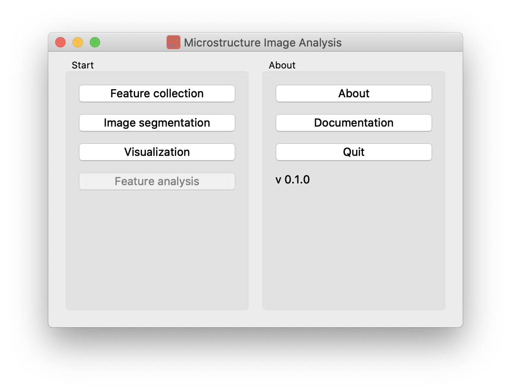

# Microstructure Image Analysis

## About

This is a GUI app for simple feature collection and image segmentation.



## Installation

1. Download the app from the [releases page](https://github.com/wufeim/microstructure-characterization-II/releases). Unzip the folder.

2. Configure the Python environment according to ```requirements.txt```. (You may want to install [virtualenv](https://packaging.python.org/guides/installing-using-pip-and-virtual-environments/).) A command-line example (Linux and MacOS):
   ```sh
   $ python3 -m venv pyqt
   $ source pyqt/bin/activate
   $ pip3 install -r requirements.txt
   ```

3. Run the app with:
   ```sh
   $ python3 main.py
   ```

## Documentation

See [documentation.md](documentation.md).

## License

This work is released under [GNU General Public License 3.0](https://choosealicense.com/licenses/gpl-3.0/).

If you use our algorithms or this toolbox in an academic work, please cite:

```
@article{doi:10.1063/5.0013720,
author = {Ma,W. and Kautz,E. J. and Baskaran,A. and Chowdhury,A. and Joshi,V. and Yener,B. and Lewis,D. J.},
title = {Image-driven discriminative and generative machine learning algorithms for establishing microstructure–processing relationships},
journal = {Journal of Applied Physics},
volume = {128},
number = {13},
pages = {134901},
year = {2020},
doi = {10.1063/5.0013720},
URL = {https://doi.org/10.1063/5.0013720},
eprint = {https://doi.org/10.1063/5.0013720}
}
```

## References

* Image-driven discriminative and generative machine learning algorithms for establishing microstructure-processing relationships: [paper](https://doi.org/10.1063/5.0013720)
* An image-driven machine learning approach to kinetic modeling of a discontinuous precipitation reaction: [paper](https://doi.org/10.1016/j.matchar.2020.110379)

## Contact

* Corresponding author: [Elizabeth Kautz](mailto:elizabeth.kautz@pnnl.gov)
* GUI app bug report: [Wufei Ma](mailto:wufeim@purdue.edu)

*Last update: Oct. 05, 2020*
